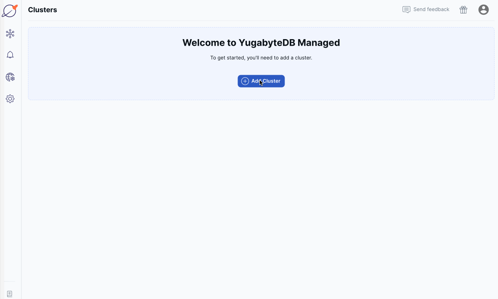

# Simple Elixir Application for YugabyteDB

The code sample shows how to create a simple Elixir app that works with YugabyteDB using the [Postgrex driver](https://docs.yugabyte.com/latest/integrations/jdbc-driver/) or the [Phoenix framework](https://www.phoenixframework.org).

The instructions below are provided for [YugabyteDB Aeon](https://cloud.yugabyte.com/) deployments. However, the app also works with other types of deployments, including database instances running on [your own laptop](https://docs.yugabyte.com/preview/quick-start/docker/).

## Prerequisite

* [The latest versions](https://elixir-lang.org/docs.html) of the Elixir, Erlang VM, IEx and Mix.
* If you plan to run the Phoenix sample app, then install all the [required components](https://hexdocs.pm/phoenix/installation.html). Note, you don't need to install Postgres for Phoenix as long as you'll use YugabyteDB.
* Command line tool or your favourite IDE, such as IntelliJ IDEA, or Eclipse.

## Start YugabyteDB Aeon Cluster

* [Start](https://docs.yugabyte.com/latest/yugabyte-cloud/cloud-quickstart/qs-add/) a free instance of YugabyteDB Aeon.
* Add an IP address of your machine/laptop to the [IP allow list](https://docs.yugabyte.com/latest/yugabyte-cloud/cloud-secure-clusters/add-connections/#manage-ip-allow-lists)



## Run the App

Clone the application repo:

```bash
git clone https://github.com/YugabyteDB-Samples/yugabytedb-simple-elixir-app.git && cd yugabytedb-simple-elixir-app
```

Start the app using the Postgrex driver or Phoenix framework:

* [Simple Elixir App With Postgrex](postgrex/simple_app/README.md)
* [Simple Elixir App with Phoenix](phoenix/TBD)

## Stay in touch

Having issues running this application or want to learn more from the Yugabyte community?

Join [our Slack channel](https://communityinviter.com/apps/yugabyte-db/register)!
